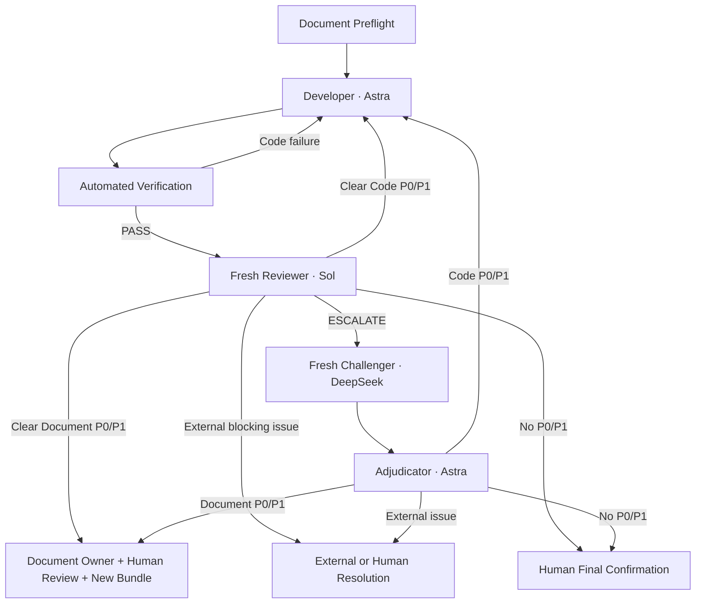

# Local Agent Platform

A Windows-first, local-first reference implementation for contract-driven
coding workflows. It provides the same Coding Agent Loop through Mastra and
LangGraph, with isolated role contexts, deterministic verification, durable
Developer recovery, and human-only release authority.

> Status: early preview (`v0.1.0`). Use it on disposable branches or worktrees
> until you have reviewed the project profile, Frozen Bundle, and write scope.

## Why this exists

Long coding-agent runs commonly lose work on timeout, mix reviewer context with
developer assumptions, or treat a green test as release approval. This platform
separates those concerns:

- Developer is the only role that can modify product files.
- A fresh Reviewer routes clear outcomes directly.
- DeepSeek Challenger and Astra Adjudicator run only when Reviewer returns
  `ESCALATE` for high risk, weak evidence, or conflicting conclusions.
- Deterministic verification runs outside the model.
- Failed Developer workspaces, diffs, event logs, and resumable context are
  retained instead of deleted.
- Only a human decision bound to the exact Bundle and snapshot can issue GO.

## Workflow



The published Prompt authority is
[`TC-SESSION-PROMPT-v2.9`](prompts/coding-agent-loop/tc-agent-loop-v2.9-v1.0-r10-bundle-v1/core-prompt-v2.9.md),
SHA-256
`865da58c80dc9afd904ab476c0407bad4258b6edc7505f78c9473d7c5174481e`.
Older Prompt bundles remain immutable and append-only.

## Components

| Component | Default URL | Purpose |
|---|---:|---|
| Unified Hub | <http://localhost:3000> | Links and service overview |
| Mastra Coding Platform | <http://localhost:4113> | Mastra workflow and Studio |
| LangGraph Coding Platform | <http://localhost:4130/ui> | Checkpoint-based workflow and visual console |
| Multica Bridge | <http://localhost:4120/healthz> | Optional ticket/status integration |

Mastra and LangGraph are alternative orchestration engines. A run belongs to
exactly one engine, while both reuse the same Prompt, profile registry, Frozen
Bundle checks, role adapters, verification, writer lock, and recovery data.

## Requirements

- Windows 11 and PowerShell
- Node.js 22.13 or newer
- Python 3.12 or newer
- Git
- Codex CLI authenticated with `codex login`
- Access to the model identifiers frozen by Prompt v2.9:
  - Developer and conditional Adjudicator: `gpt-6-astra`
  - Document Preflight and Reviewer: `gpt-5.6-sol`
  - Conditional Challenger: `deepseek/deepseek-v4-flash` through OpenRouter

The current release is intentionally Windows-first. Cross-platform shell
scripts and model-name portability are not yet guaranteed.

## Quick start

```powershell
git clone https://github.com/Mqw7373/local-agent-platform.git
Set-Location local-agent-platform
npm run bootstrap
npm run check
codex login status
npm run start:local
npm run status
```

Open Mastra Studio at <http://localhost:4113> or the LangGraph console at
<http://localhost:4130/ui>.

Stop only the processes recorded by the platform launcher:

```powershell
npm run stop:local
```

## Register a local repository

Machine-specific profiles are deliberately ignored by Git.

1. Copy
   `services/mastra-coding-platform/coding-agent.profiles.example.json` to
   `services/mastra-coding-platform/coding-agent.profiles.json`.
2. Copy `services/mastra-coding-platform/coding-agent.config.json` to a JSON
   file under `services/mastra-coding-platform/profiles/`.
3. Set `projectRoot`, document paths, `bundleFile`, allowed roots, verification
   commands, and allowed/protected scopes.
4. Register the profile file in the local registry.
5. Run `npm run profiles --prefix services/mastra-coding-platform`.

When the local registry does not exist, the platform falls back to the public
example registry. You can also select a registry explicitly:

```powershell
$env:CODING_AGENT_PROFILES = 'D:\agent-config\coding-agent.profiles.json'
```

Never commit a real profile, private repository name, proprietary document
path, credential, or Frozen Bundle.

## Freeze the implementation input

The Coding Loop expects a human-approved Bundle binding the applicable PRD,
ADR, System Design, API Contract, Acceptance Criteria, and Migration Contract
when persisted data changes.

```powershell
Set-Location services\mastra-coding-platform
npm run freeze-bundle -- `
  --profile 'my-project' `
  --approved-by 'reviewer-name' `
  --objective 'Implement the approved scope'
```

Document Preflight must validate that Bundle before Developer receives write
authority.

## Configuration and credentials

Copy `.env.example` only as a reference; the launcher currently reads process
environment variables rather than parsing the file automatically.

```powershell
$env:LOCAL_AGENT_PLATFORM_HOME = 'D:\local-agent-state'
$env:OPENROUTER_API_KEY = '<required only for ESCALATE>'
```

Codex roles use the machine's saved Codex login. Do not copy, commit, or expose
the Codex authentication file. The adapter removes `OPENAI_API_KEY` and
`CODEX_API_KEY` from role subprocess environments.

`OPENROUTER_API_KEY` is not needed for ordinary Reviewer direct routing. If the
Reviewer escalates and the credential is unavailable, only that escalation
branch stops as `PLATFORM_LIMITATION`; no fallback model is substituted.

## Recovery and local state

Generated state is stored outside the repository by default:

```text
%USERPROFILE%\.local-agent-platform\
  logs\
  runtime\
  state\
```

Failed Developer executions retain their isolated workspace, diff, redacted
JSONL events, task context, baseline map, process metadata, and recovery
manifest. Recovery verifies the Bundle, baseline, process state, known side
effects, and Codex session before resuming. Retention never authorizes automatic
write-back to the product repository.

## Tests

`npm run check` performs deterministic checks only; it does not launch a real
Developer or call a paid model provider.

```powershell
npm run check
```

The suite covers Prompt SHA binding, role/model routing, Reviewer direct paths,
conditional escalation, profile isolation, Developer-only writer locking,
failed-workspace retention, safe resume assessment, LangGraph checkpoints, and
Multica synchronization.

## Ponytail experiment

Ponytail `v4.9.0` is pinned to commit
`0a4dd63ad4541f4f655c4108a295916f3c1d8fda` and is available only as a
Developer `lite` A/B treatment. Normal runs use the control arm. It is disabled
for Reviewer, Challenger, Adjudicator, and Document Preflight; lifecycle hooks
and `SubagentStart` injection are not enabled. Frozen Bundle and verification
requirements always outrank its minimization guidance.

See [THIRD_PARTY_NOTICES.md](THIRD_PARTY_NOTICES.md) for attribution.

## Security and contribution

- Report vulnerabilities through GitHub private vulnerability reporting; see
  [SECURITY.md](SECURITY.md).
- Contribution requirements are in [CONTRIBUTING.md](CONTRIBUTING.md).
- Licensed under Apache-2.0; see [LICENSE](LICENSE).

This is a reference implementation, not a hosted service or an automatic
release authority. Review all generated diffs and human-confirm every release.
