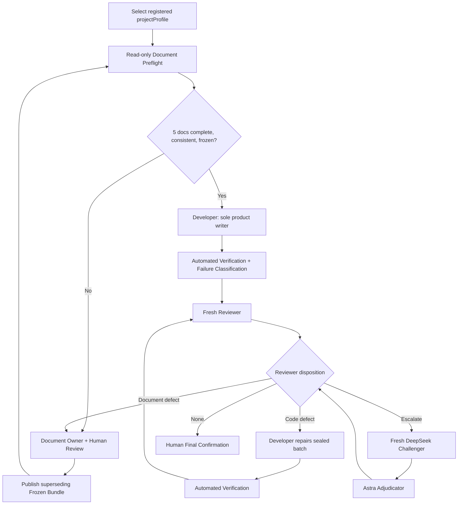

# Mastra Coding Agent Loop

这是 TC Contract-First Agent Loop 的常驻、多项目 Mastra 编排层。每次运行通过 `projectProfile` 选择已注册代码库，无需为切换项目重启 Mastra。模型执行由本机 Codex CLI Adapter 提供：Developer 使用隔离、持久且可恢复的 session；所有只读角色使用全新的 ephemeral context，角色之间不共享会话或 rollout。

Prompt authority：

- Revision: `TC-SESSION-PROMPT-v2.9`
- SHA-256: `865da58c80dc9afd904ab476c0407bad4258b6edc7505f78c9473d7c5174481e`
- 本机文件：`../../prompts/coding-agent-loop/tc-agent-loop-v2.9-v1.0-r10-bundle-v1/core-prompt-v2.9.md`

## 流程



Document Preflight 通过后会封存内容寻址的 `DocumentPreflightReceipt`，绑定 task SHA 与 Bundle SHA；Developer dispatch 必须验证并接收该 receipt。每个绿色 snapshot 都进入一个 fresh Reviewer：明确结论直接路由，只有 `ESCALATE` 才启动 Fresh Challenger 和 Adjudicator。不存在额外的 Final Challenger 或 Final Adjudication；accepted P2 跨轮次保留并展示给 Human Final Confirmation。

Verification FAIL 先分类再路由。只有与非空候选 diff 绑定且没有外部失败信号的 `CODE_DEFECT` 会回 Developer；`BASELINE_FAILURE`、`PLATFORM_LIMITATION`、`PROFILE_DEFECT` 和 `EXECUTION_VIOLATION` 在 Developer 外停止。`changedPaths=[]` 不增加 `cycleCount`；remediation no-op 会立即 fail closed，避免空循环耗尽上限。

角色执行绑定由 Prompt v2.9 固定：Document Preflight 与 Reviewer 使用独立的 `gpt-5.6-sol` Codex execution，Developer 与按需 Adjudicator 使用独立的 `gpt-6-astra` Codex execution，按需 Challenger 通过外部只读 adapter 使用 `deepseek/deepseek-v4-flash`。`OPENROUTER_API_KEY` 只在 Reviewer 返回 `ESCALATE` 后需要；普通直接路由不会因 Challenger provider 不可用而失败。

Ponytail `v4.9.0`（source commit `0a4dd63ad4541f4f655c4108a295916f3c1d8fda`）目前只作为 Developer 的 `lite` A/B treatment 存在，正常 Mastra/LangGraph workflow 均保持 `control/off`。Adapter 不安装或执行上游 Hook，不启用 `SubagentStart` 注入，并对 Document Preflight、Reviewer、Challenger、Adjudicator 显式注入 `DISABLED` 边界。Frozen Bundle、Core Prompt、Acceptance Criteria、完整回归与 configured verification 始终优先，不能被 Ponytail 的最小化规则削减。

Studio 中该流程使用可展开的原生 nested workflows：顶层展示 Runtime/Bundle Preflight、Document Preflight、Candidate Review Cycle 和 Human Final Confirmation；Candidate Review Cycle 内展示 Developer/Verification 循环、Reviewer，以及仅在 `ESCALATE` 时执行模型调用的 Challenger/Adjudicator 步骤。

由于当前 Windows Codex CLI 的 `read-only` 和 `workspace-write` sandbox 都会阻止本地 shell 命令，所有角色都在隔离 Git 镜像中使用 `danger-full-access`。Reviewer、Challenger、Adjudicator 和 Document Preflight 的一次性镜像执行后删除，因此对真实产品仓库仍是只读。Developer 使用 Profile runtime 下的持久 execution workspace 与非 ephemeral Codex session；失败时保存完整现场但不写回产品仓库，成功批次经 Adapter diff gate 后才原子应用。冻结文档、Bundle、`protectedPaths`、越界路径、未授权删除以及不满足原始 SHA 的并发覆盖都会被拒绝。Mastra 不注册另一套产品写工具。

## 多项目 Profile Registry

`coding-agent.profiles.json` 是唯一项目入口：

```json
{
  "allowedRoots": ["${USERPROFILE}/Documents/github"],
  "profiles": {
    "my-project": {
      "configFile": "./profiles/my-project.json",
      "enabled": true,
      "description": "My product repository"
    }
  }
}
```

- `allowedRoots` 是平台管理员白名单。任何 Profile 的 `projectRoot` 越界都会在 Developer 进入前失败。
- `profiles` 是每次调用可选择的项目集合。Workflow 输入只能选择启用的 ID，不能传任意绝对路径。
- 每个 Profile 使用一份独立项目配置；切换 Profile 不需要重启服务。
- 可以运行 `npm run profiles`，或在 Studio 运行 `project-profile-catalog` 查看可选 Profile。
- 若需要另一套 Registry，可在启动时设置 `CODING_AGENT_PROFILES`；这是部署级选择，不是每次任务选择。

每份 Profile 配置沿用 `coding-agent.config.json` 的结构：

1. `projectRoot` 指向目标代码库。
2. 填入已有 PRD、ADR、System Design、API Contract、Acceptance Criteria 的相对路径。
3. `verificationCommands` 使用 `command + args` 数组，并可用 `env` 提供命令级环境变量；Windows 可执行 npm 时用 `npm.cmd`，macOS/Linux 用 `npm`。
4. `runtimeDir` 应位于产品候选目录之外，用于 `trace.jsonl`。
5. `promptMode` 默认 `distilled`；若确实需要每个角色携带完整 Core Prompt，可改为 `full`，但会显著增加 token 和运行时间。
6. 同一 Profile 的 Trace 自动写入独立的 `runtime/<profileId>/trace.jsonl`。

## 冻结文档 Bundle

Agent 不会修改或替你批准产品文档。Document Owner 修改五份文档并完成人工审核后，由人执行：

```powershell
npm run freeze-bundle -- --profile "my-project" --approved-by "name" --objective "implementation objective"
```

该命令只生成一个紧凑 Bundle：五个路径、五个 SHA、批准人、时间和目标。它不是 inventory/manifest 治理系统，也没有外部 validator。

## 启动

```powershell
npm run codex:status
npm run self-test
npm run codex-adapter-test
npm run typecheck
npm run dev
```

执行一次不会写入产品仓库的 A/B pilot：

```powershell
npm run ponytail-ab-test -- --profile "my-project"
```

Control 与 `ponytail-lite` 使用相同的 `gpt-6-astra`、相同合成任务和彼此隔离的 `%TEMP%` Git 仓库。结果写入该 Profile 的 `runtime/.../experiments`；`n=1` 仅提供方向性证据，脚本固定输出 `NO_AUTOMATIC_ROLLOUT`。

不需要设置 `OPENAI_API_KEY`。Adapter 显式从子进程环境中移除 `OPENAI_API_KEY` 和 `CODEX_API_KEY`，Codex CLI 使用本机已保存的 ChatGPT/Codex 登录。若尚未登录，先单独运行 `codex login`；不要复制或暴露 `~/.codex/auth.json`。

在 Mastra Studio 中运行 `coding-agent-loop`，输入：

```json
{
  "projectProfile": "my-project",
  "task": "Implement the frozen requirements"
}
```

候选达到最终条件时 Workflow 会 suspend，等待 `human-final-confirmation`：

```json
{
  "decision": "GO",
  "confirmedBy": "human-name",
  "note": "Reviewed final evidence"
}
```

如果是文档缺陷，Workflow 返回 `NEEDS_DOCUMENT_REVIEW` 并结束当前 Implementation Cycle；修订、人工审核和新 Bundle 后重新运行。如果只是代码缺陷，则保持同一 Bundle SHA，在同一运行中回到 Developer。

## 可观察证据

`runtime/<profileId>/trace.jsonl` 记录 phase transition、Codex task ID、sandbox、耗时、usage、输出 SHA、Developer diff 的 before/after SHA、验证命令、Adjudication Decision 和最终人工决定。Developer 的逐事件脱敏 JSONL、当前操作、任务上下文、基线、diff、stderr 与恢复 manifest 另存于 `runtime/<profileId>/developer-executions/<executionId>/`；内存输出长度限制不影响该持久事件流。它不记录也不要求模型隐藏思维链。

Workflow suspend/run snapshot 默认持久化到 `%USERPROFILE%/.local-agent-platform/state/mastra-coding-platform/mastra.db`，因此服务重启后仍可恢复人工确认。生产环境可通过 `MASTRA_DB_URL` 改为受管 LibSQL/Turso URL。

Workflow 只接受 Registry 中已启用的 Profile ID，Codex task 不能通过模型文本替换真实根目录。并发运行不同 Profile 时，文件根目录、验证命令、Frozen Bundle、Developer 临时镜像和 Trace 都保持隔离。

## 与 LangGraph 并列运行

公共平台中的 `services/langgraph-coding-platform` 是另一套 orchestration authority，不是 Mastra 内部子流程。它通过 `scripts/langgraph-runtime-bridge.ts` 复用本服务的 Prompt、Profile、Bundle、Codex Adapter、verification 和 audit 能力。两套引擎的 checkpoint 与 run namespace 分开；Developer 写真实仓库前则共用每个 Profile 的 `developer-writer.lock.json`，并发写入会被拒绝。单次 run 必须从头到尾只选择一个引擎，A/B 比较应使用隔离 worktree。
